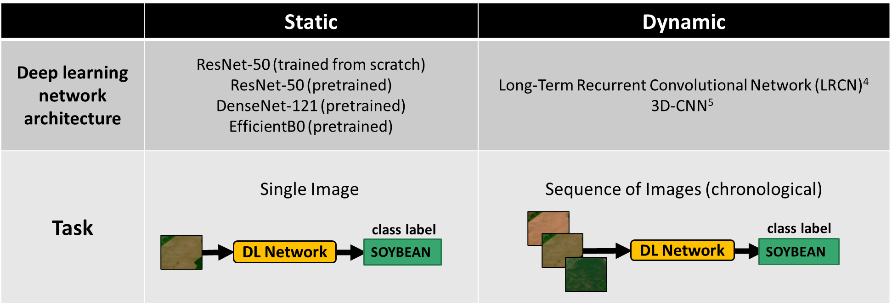

<h1 style="text-align: center;"> Benchmarking </h1>

We present two classification experiments performed using the 2019 version of the dataset to infer the main crop types present in each image. In the first experiment, *static classification*, we treated each individual image as a training instance (static image classification). In the second experiment, *dynamic classification* we explored the use of a temporal image series as an input. 

Tables showing results for both experiments are figured below. 

### Static Classification 

#### Models Used:

- ResNet

Reference: *Deep residual learning for image recognition.* 

> Kaiming He, Xiangyu Zhang, Shaoqing Ren, and Jian Sun. Deep residual learning for image recognition. In IEEE Conference on Computer Vision and Pattern Recognition, pages 770–778, 12 2016.

[https://arxiv.org/abs/1512.03385]

- DenseNet 

Reference: *Densely connected convolutional networks* 

> Gao Huang, Zhuang Liu, and Kilian Q. Weinberger. Densely connected convolutional networks. CoRR, abs/1608.06993, 2016.

[https://arxiv.org/abs/1608.06993]

- EfficientNet

Reference: *Efficientnet: Rethinking model scaling for convolutional neural networks.*

> Mingxing Tan and Quoc V. Le. Efficientnet: Rethinking model scaling for convolutional neural networks.CoRR, abs/1905.11946, 2019.

[https://arxiv.org/abs/1905.11946]

___

### Dynamic Image Classification 

#### Models Used: 

- 3 Dimensional Convolutional Network 

Reference: *Uniformizing techniques to process CT scans with 3D CNNs for tuberculosis prediction.*

> Zunair, H., Rahman, A., Mohammed, N., & Cohen, J. P. (2020, October). Uniformizing techniques to process CT scans with 3D CNNs for tuberculosis prediction.
In International Workshop on PRedictive Intelligence In MEdicine (pp. 156-168). Springer, Cham.

[https://arxiv.org/abs/2007.13224]

- Long-Term Recurrent Convolutional Networks (LRCN)

Reference: *Long-term recurrent convolutional networks for visual recognition and description.*

> J. Donahue, L. Hendricks, S. Guadarrama, M. Rohrbach, S. Venugopalan, T. Darrell, and K. Saenko. CVPR , page 2625-2634. IEEE Computer Society, (2015)

[https://arxiv.org/pdf/1411.4389v3.pdf]

___
