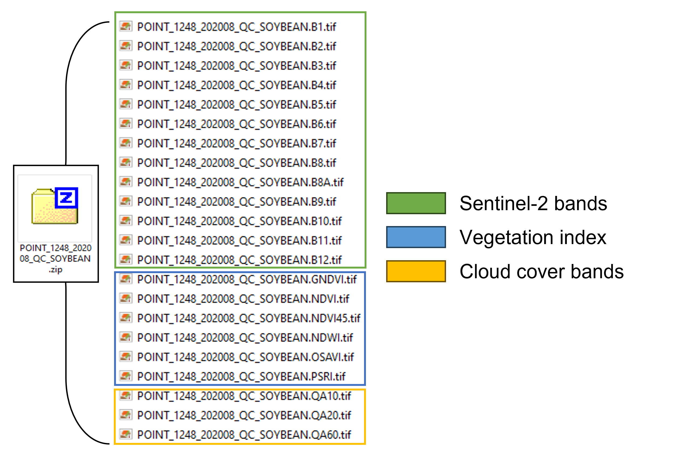
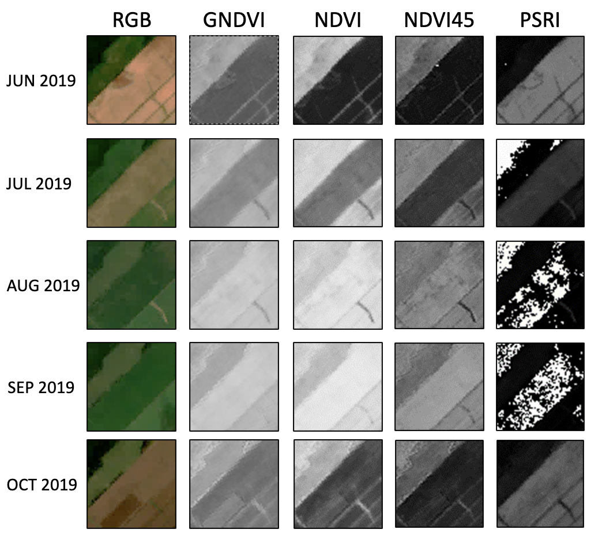

## Image and Label Collection

___

### Point Selection
A total of 6,633 geographical points were randomnly chosen to generate the *Canadian Cropland Dataset*. Each point represents the center of a farmland within any of the 10 Canadian provinces. With these geographical points, we then extracted imagery that captures a region of 640m x 640m centered around each coordinate. A map showing the locations chosen and the crop categories (2019 version of the dataset) is figured below. 

<div align="center">
  
</div>
   
### Data Labelling
To label each image, we used the [*Canadian Annual Crop Inventory (ACI)*](https://www.agr.gc.ca/atlas/apps/metrics/index-en.html?appid=aci-iac), an open-source geospatial landcover map developed by Agriculture and Agri-Food Canada (AAFC). The ACI reports the types of crops present on the Canadian territory that fall within 72 crop categories. It is distributed using an Open Government License. The overall target accuracy of the ACI is at least 85% at a resolution of 30m/pixel. 

### Crop Rotation
Because this dataset is released as a multi-year dataset, the crop label of a point may change over time due to crop rotation patterns. 
- Crop rotation is the practice of planting different crops sequentially on the same plot.
- Crop rotation has been proven to deliver greater soil fertility
- Increase the economic potential of a field and preserve soil health 
- Gives rise to a rich multi-year dataset with unique long-term crop rotation patterns.
- Figure out what else I'd like to say about this.... 
(Add references)
 
### Image retrieval 

The images in this dataset come from the *Sentinel-2 (S2)*  satellite constellation and were downloaded using [*Google Earth Engine (GEE)*](https://earthengine.google.com/). Each raw spectral image is contained in a *.zip* folder with 12 spectral geo-referenced *.TIF* images which range from the Visible Near Infra-Red (VNIR) and Near Infra-Red (NIR) to the Short Wave Infra-Red (SWIR) wavelengths (bands B1-B12). Using the original Sentinel-2 bands, we derived additional bands that correspond to common vegetation indices (see the section *Features* below for their mathematical definitions). Bands QA10 and QA20 are automatically downloaded with GEE and contain no data. Band QA60 is cloud cover mask reporting the presence of either opaque or cirrus clouds in each pixel.  

<div align="center">
  
</div>
   

The spatial resolutions of each of the main bands are reported in the table below:


| Band name | Spatial resolution (pixels/m) | Central wavelength (nm) | Description |
|:---------:|:----------------------------:|:-----------------------:|:-----------:|
| B1        | 60                           | 444                     | Aerosols    |
| B2        | 10                           | 497                     | Blue        |
| B3        | 10                           | 560                     | Green       |
| B4        | 10                           | 665                     | Red         |
| B5        | 20                           | 704                     | Red Edge 1  |
| B6        | 20                           | 740                     | Red Edge 2  |
| B7        | 20                           | 783                     | Red Edge 3  |
| B8        | 10                           | 835                     | NIR         |
| B8A       | 20                           | 865                     | Red Edge 4  |
| B9        | 60                           | 945                     | Water Vapor |
| B11       | 20                           | 1614                    | SWIR 1      |
| B12       | 20                           | 2202                    | SWIR 2      |
| GNDVI     | 10                           |N/A                      | Veg Index   |
| NDVI      | 10                           |N/A                      | Veg Index   |
| NDVI45    | 10                           |N/A                      | Veg Index   |
| NDWI      | 10                           |N/A                      | Veg Index   |
| OSAVI     | 10                           |N/A                      | Veg Index   |
| PSRI      | 10                           |N/A                      | Veg Index   |

### Vegetation indices 

Vegetation indices quantify traits such as the amount of biomass, the vigor or the growth dynamics present in a spectral image (Jinru Xue and Baofeng Su. (2017) Significant remote sensing vegetation indices: A review of
developments and applications. Journal of Sensors.)

<table style="border-collapse: collapse; table-layout: fixed; width: 100%;">
  <tr>
    <th style="border: 1px solid black; text-align: center; width: 10%;">Index</th>
    <th style="border: 1px solid black; text-align: center; width: 60%;">Description</th>
  </tr>
  <tr style="background-color: #f2f2f2;">
    <td style="border: 1px solid black; text-align: center; width: 10%;">NDVI</td>
    <td style="border: 1px solid black; text-align: center; width: 60%;">Indicator of plant growth and health, measures emitted chlorophyll</td>
  </tr>
  <tr>
    <td style="border: 1px solid black; text-align: center; width: 10%;">NDVI45</td>
    <td style="border: 1px solid black; text-align: center; width: 60%;">Indicates the amount of biomass and evapotranspiration, provides information on canopy structure</td>
  </tr>
  <tr style="background-color: #f2f2f2;">
    <td style="border: 1px solid black; text-align: center; width: 10%;">GNDVI</td>
    <td style="border: 1px solid black; text-align: center; width: 60%;">Correlates to the rate of photosynthesis, used to monitor plant stress</td>
  </tr>
  <tr>
    <td style="border: 1px solid black; text-align: center; width: 10%;">PSRI</td>
    <td style="border: 1px solid black; text-align: center; width: 60%;">Measures the onset, the stage, and the relative rates of the senescence or ripening of a crop cover</td>
  </tr>
  <tr style="background-color: #f2f2f2;">
    <td style="border: 1px solid black; text-align: center; width: 10%;">OSAVI</td>
    <td style="border: 1px solid black; text-align: center; width: 60%;">Provides an estimate of biomass that is more resilient when faced with soil and atmospheric effects</td>
  </tr>
</table>

- **NDVI** The *Normalized Difference Vegetation Index* is one of the most predominantly used indicators of plant growth and health. It correlates with the amount of chlorophyll emitted by a plant. NDVI is defined as:  

     *NDVI = (ρ<sub>NIR</sub> - ρ<sub>red</sub>) / (ρ<sub>NIR</sub> + ρ<sub>red</sub>)*  
     
Where ρ<sub>NIR</sub> is equal to the NIR band and ρ<sub>red</sub> is the visible red band (represented by bands B8 and B4).

- **NDVI45** The *NDV45* vegetation index is a revised version of the NDVI. It is strongly correlated with the leaf area index (LAI), which is an estimate of the amount of biomass and vegetative evapotranspiration, and provides information regarding the structure of a canopy. NDVI45 is defined as:  

     *NDVI45 = (R<sub>704</sub> - ρ<sub>red</sub>) / (R<sub>704</sub> + ρ<sub>red</sub>)*  

Where R<sub>704</sub> is the NIR spectral band centered at 704 nm (B5).  

- **GNDVI** The *Green Normalized Difference Vegetation Index* was shown to correlate to the rate of photosynthesis and is used to monitor plant stress. GNDVI is calculated in a way that is analogous to NDVI, however the red band is replaced by the green band (ρ<sub>green</sub>). GNDVI is defined as:  

     *GNDVI = (ρ<sub>NIR</sub> - ρ<sub>green</sub>) / (ρ<sub>NIR</sub> + ρ<sub>green</sub>)*  

- **PSRI** The *Plant Senescence Reflectance Index* is used to measure the onset, the stage, and the relative rates of the senescence or ripening of a crop cover. An increase in PSRI indicates heightened canopy stress. PSRI is defined by the equation:  

     *PSRI = (ρ<sub>red</sub> - ρ<sub>blue</sub>) / R<sub>750</sub>*  

Where R<sub>750</sub> is the NIR spectral band centered at 750 nm (B6).  

- **OSAVI** In conditions when vegetation is low and soil properties are unknown, indices like the NDVI can be subject to bias due to high levels of reflection. The *Optimized Soil-Adjusted Variation Index* was created to provide an estimate of biomass that is more resilient when faced with soil and atmospheric effects. OSAVI is defined as:  

     *OSAVI = (ρ<sub>NIR</sub> - ρ<sub>red</sub>) / (ρ<sub>NIR</sub> + ρ<sub>red</sub> + 0.16)*  

___

### Data cleaning

We apply a bitwise filter to images to remove any with a cloud cover percentage above 5%. Following this, a median composite image was produced by calculating the median of the values across all pixels of a given .tif image in a monthly collection. We generate median composites to replace any remaining pixels labelled as clouds with data values. Median images of croplands at five different periods in the growth season (June, July, August, September and October) were retrieved for each year included in the dataset.

In the last cleaning step, the data were curated using visual observation to exclude any low quality images that contained satellite artifacts or cloud pixels missed by the previously applied filters. This cleaning step was performed by 2 trained individuals.

The dataset also comes prepackaged in dedicated training (70%), validation (15%) and testing sets (15%). These sets remain the same for each individual year and image type (i.e NDVI, PSRI, etc.). Images belonging to the same geographical coordinates were kept together in the same set during the dataset splitting process. 

___


## PNG files

Our "cleaned" version of the dataset contains RGB images, as well as the vegetation index images, in the .PNG format. The RGB image was created by combining the visible red, green and blue bands (identified as the S2 bands: B4, B3, B2) in a single image. For the vegetation index bands, the .PNG image was created by generated by duplicating the information across the 3 channels. The following figure shows an example of .PNG images belonging to a sample point.

<div align="center">
  
</div>


 Each cleaned version of the 5 datasets is packaged in a .zip file  with a training, validation and testing directory. Images captured from the same field (i.e: having the same point I.D.) are kept together in the same set during the splitting process. 


```
RGB/
...training/
......BARLEY/
.........POINT_2_201909_AB_BARLEY_RGB.png
.........POINT_2_201910_AB_BARLEY_RGB.png
......CORN/
.........POINT_5_201907_AB_CORN_RGB.png
.........POINT_5_201908_AB_CORN_RGB.png
.........POINT_5_201909_AB_CORN_RGB.png
...validation/
......BARLEY/
.........POINT_9_201908_AB_BARLEY_RGB.png
.........POINT_9_201909_AB_BARLEY_RGB.png
.........POINT_9_201910_AB_BARLEY_RGB.png
......CORN/
.........POINT_22_201907_AB_CORN_RGB.png
.........POINT_22_201908_AB_CORN_RGB.png
.........POINT_22_201909_AB_CORN_RGB.png
......CORN/
.........POINT_15_201908_AB_CORN_RGB.png
.........POINT_15_201909_AB_CORN_RGB.png
...test/
......BARLEY/
.........POINT_12_201907_AB_BARLEY_RGB.png
.........POINT_12_201908_AB_BARLEY_RGB.png
.........POINT_12_201909_AB_BARLEY_RGB.png
.........POINT_12_201910_AB_BARLEY_RGB.png
```

This structure allows the use of the Keras function ```flow_from_directory``` when building machine learning models: 
 
```python
tf.keras.preprocessing.flow_from_directory("directory name")
```
___


## Dataset Statistics 

Contains spreadsheets and figures depicting the distribution of the images within the dataset. The figures are bar charts representing several counts (crop, image, month and province) from year 2016 to 2019 first all together then showing each year individually.


#### Count of the number of images for each crop type 

<div align="center">
  
  
</div>

#### Count of the number of sets for each image in a set

<div align="center">
    
    
</div>

#### Count of the number of images for each month

<div align="center">
    
    
</div>

#### Count of the number of images for each province

<div align="center">
    
    
</div>

___ 