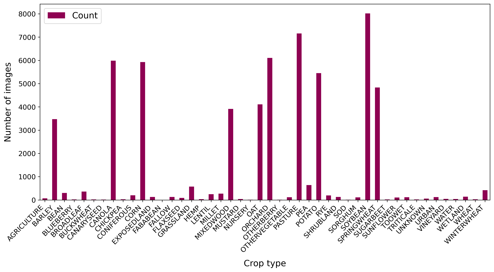
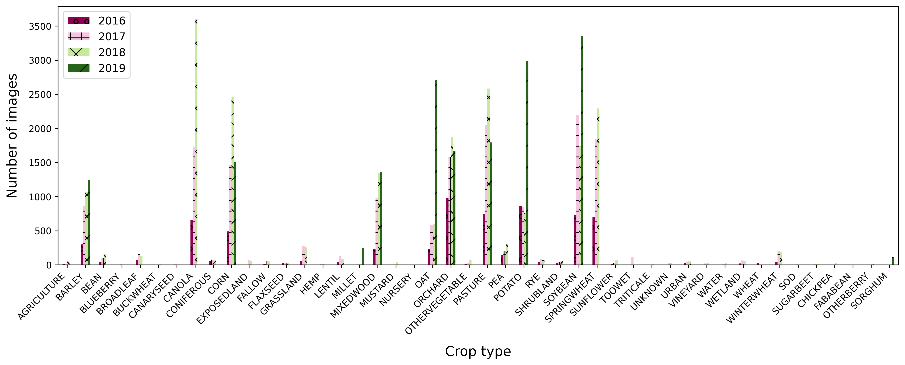

### Image and Label Collection

___

### Data Cleaning

___

### Dataset Statistics 
Contains spreadsheets and figures depicting the distribution of the images within the dataset. 

The figures are bar charts representing several counts (crop, image, month and province) from year 2016 to 2019 first all together then showing each year individually.

#### Count of the number of images for each crop type 

  
  

#### Count of the number of sets for each image in a set

    
    

#### Count of the number of images for each month

    
    

#### Count of the number of images for each province

    
    

___

### Features

- PNG files
  

  - RGB images

  - Vegetation indices (Notes: make tables less wide, and remove border around equation if possible?)

						
- .zip folders (RAW data) (Note for Amanda): Add Table with link to Google Earth Engine (Sentinel-2) band description.
 

<table style="border-collapse: collapse; table-layout: fixed; width: 100%;">
  <tr>
    <th style="border: 1px solid black; text-align: center; width: 10%;">Index</th>
    <th style="border: 1px solid black; text-align: center; width: 90%;">Description</th>
  </tr>
  <tr style="background-color: #f2f2f2;">
    <td style="border: 1px solid black; text-align: center; width: 10%;">NDVI</td>
    <td style="border: 1px solid black; text-align: center; width: 90%;">Indicator of plant growth and health, measures emitted chlorophyll</td>
  </tr>
  <tr>
    <td style="border: 1px solid black; text-align: center; width: 10%;">NDVI45</td>
    <td style="border: 1px solid black; text-align: center; width: 90%;">Indicates the amount of biomass and evapotranspiration, provides information on canopy structure</td>
  </tr>
  <tr style="background-color: #f2f2f2;">
    <td style="border: 1px solid black; text-align: center; width: 10%;">GNDVI</td>
    <td style="border: 1px solid black; text-align: center; width: 90%;">Correlates to the rate of photosynthesis, used to monitor plant stress</td>
  </tr>
  <tr>
    <td style="border: 1px solid black; text-align: center; width: 10%;">PSRI</td>
    <td style="border: 1px solid black; text-align: center; width: 90%;">Measures the onset, the stage, and the relative rates of the senescence or ripening of a crop cover</td>
  </tr>
  <tr style="background-color: #f2f2f2;">
    <td style="border: 1px solid black; text-align: center; width: 10%;">OSAVI</td>
    <td style="border: 1px solid black; text-align: center; width: 90%;">Provides an estimate of biomass that is more resilient when faced with soil and atmospheric effects</td>
  </tr>
</table>

- **NDVI** The *Normalized Difference Vegetation Index* is one of the most predominantly used indicators of plant growth and health. It correlates with the amount of chlorophyll emitted by a plant. NDVI is defined as:  

     *NDVI = (ρNIR - ρred) / (ρNIR + ρred)*  
     
Where ρNIR is equal to the NIR band and ρred is the visible red band.

- **NDVI45** The *NDV45* vegetation index is a revised version of the NDVI. It is strongly correlated with the leaf area index (LAI), which is an estimate of the amount of biomass and vegetative evapotranspiration, and provides information regarding the structure of a canopy. NDVI45 is defined as:  

     *NDVI45 = (R704 - ρred) / (R704 + ρred)*  

Where R704 is the NIR spectral band centered at 704 nm.  

- **GNDVI** The *Green Normalized Difference Vegetation Index* was shown to correlate to the rate of photosynthesis and is used to monitor plant stress. GNDVI is calculated in a way that is analogous to NDVI, however the red band is replaced by the green band (ρgreen). GNDVI is defined as:  

     *GNDVI = (ρNIR - ρgreen) / (ρNIR + ρgreen)*  

- **PSRI** The *Plant Senescence Reflectance Index* is used to measure the onset, the stage, and the relative rates of the senescence or ripening of a crop cover. An increase in PSRI indicates heightened canopy stress. PSRI is defined by the equation:  

     *PSRI = (ρred - ρblue) / R750*  

Where R750 is the NIR spectral band centered at 750 nm.  

- **OSAVI** In conditions when vegetation is low and soil properties are unknown, indices like the NDVI can be subject to bias due to high levels of reflection. The *Optimized Soil-Adjusted Variation Index* was created to provide an estimate of biomass that is more resilient when faced with soil and atmospheric effects. OSAVI is defined as:  

     *OSAVI = (ρNIR - ρred) / (ρNIR + ρred + 0.16)*  

  
___
