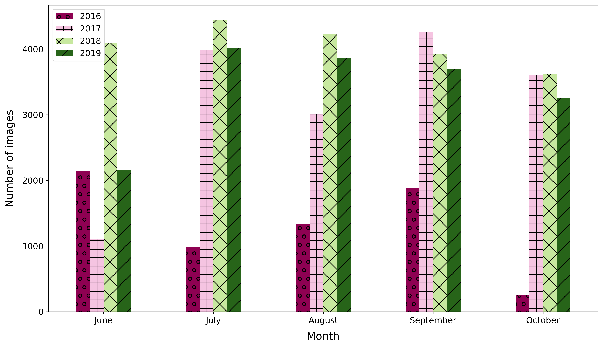
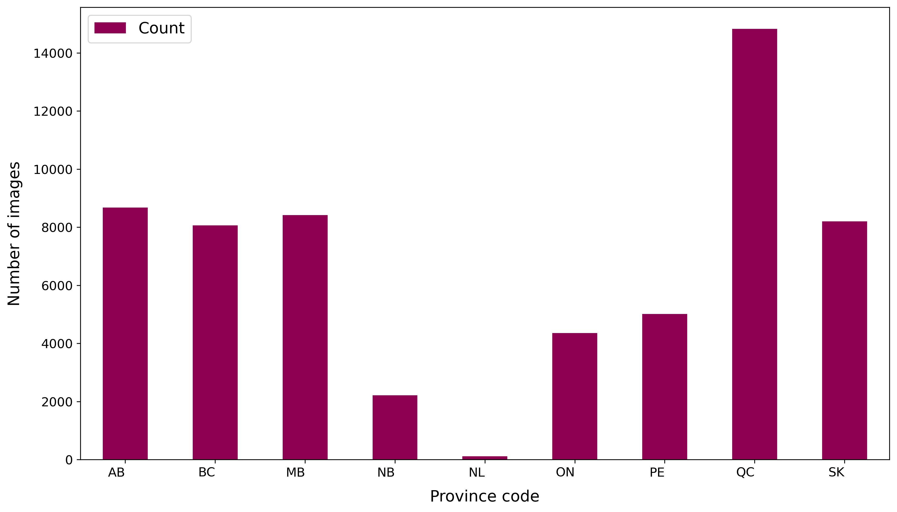

### Image and Label Collection

___

### Data Cleaning

___

### Dataset Statistics 
Contains spreadsheets and figures depicting the distribution of the images within the dataset. 

The figures are bar charts representing several counts (crop, image, month and province) from year 2016 to 2019 first all together then showing each year individually.

#### Count of the number of images for each crop type 

  
  

#### Count of the number of sets for each image in a set

    
    

#### Count of the number of images for each month

    
    

#### Count of the number of images for each province

    
    

___

### Features

- PNG files
  - RGB images
  - Vegetation indices (Notes: make tables less wide, and remove border around equation if possible?)
						
- .zip folders (RAW data) (Note for Amanda): Add Table with link to Google Earth Engine (Sentinel-2) band description.
  
___
